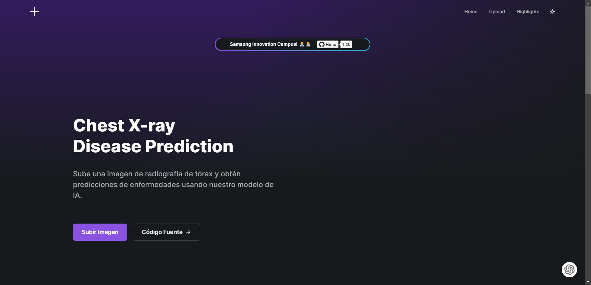
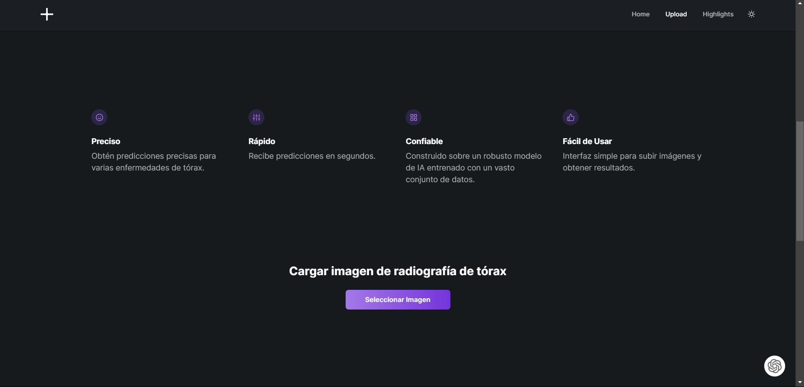
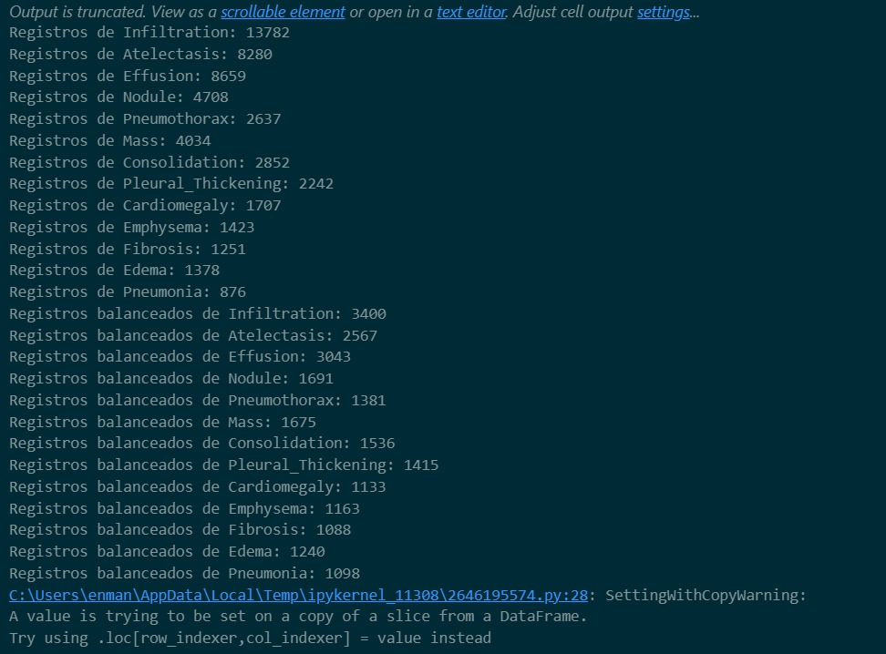
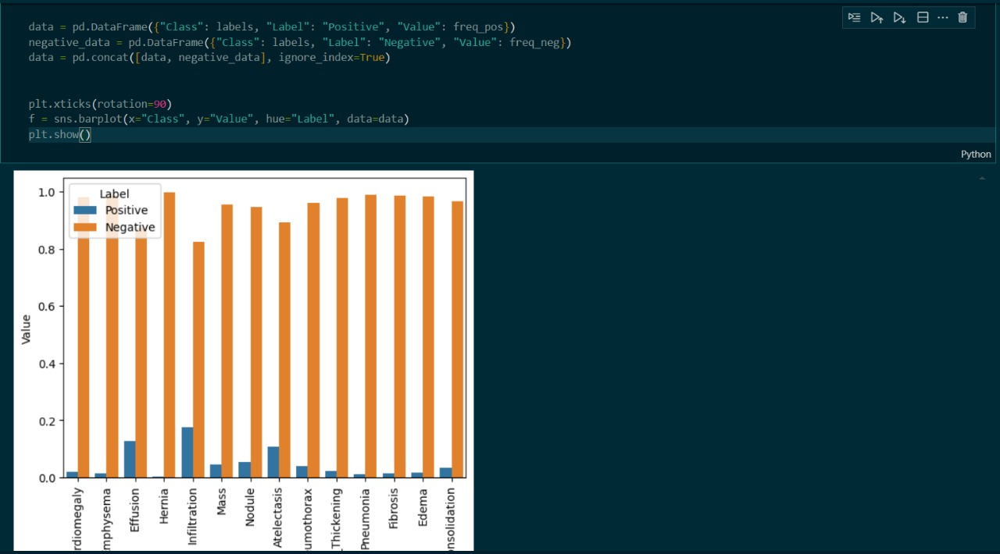
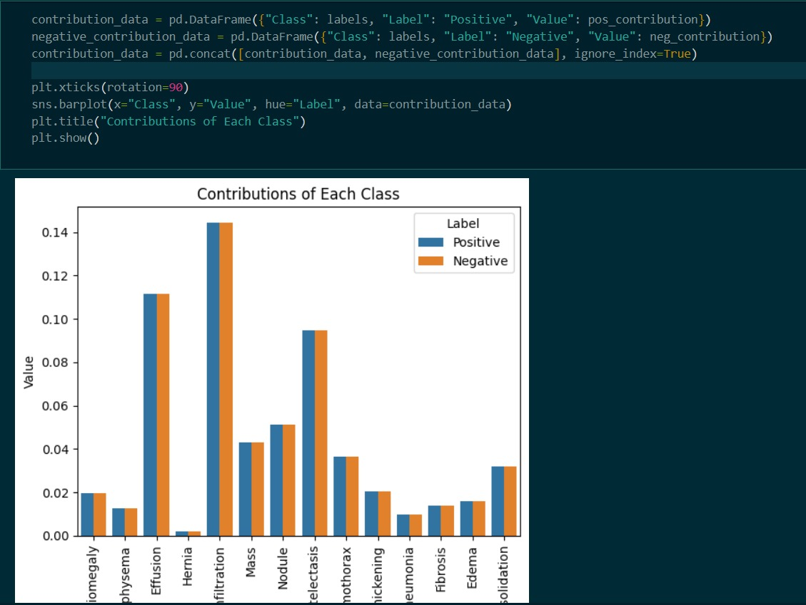

# 🩺 MedScan - Predicción de Enfermedades a partir de Radiografías de Tórax

Este proyecto presenta una innovadora herramienta basada en inteligencia artificial (IA) para el diagnóstico de enfermedades pulmonares a partir de imágenes de radiografías de tórax. La solución emplea un modelo de aprendizaje profundo entrenado para analizar las radiografías y proporcionar predicciones sobre la presencia de diversas enfermedades.

## Tabla de contenidos

1. [Introducción](#introducción)
2. [Descripción del Proyecto](#descripción-del-proyecto)
3. [Arquitectura](#arquitectura)
4. [Proceso](#proceso)
5. [Funcionalidades](#funcionalidades)
6. [Estado del Proyecto](#estado-del-proyecto)
7. [Agradecimientos](#agradecimientos)

## Introducción

MedScan es una herramienta avanzada desarrollada para analizar radiografías de tórax y asistir en el diagnóstico de enfermedades pulmonares mediante el uso de inteligencia artificial.

## Descripción del Proyecto

MedScan utiliza un modelo de aprendizaje profundo basado en redes neuronales convolucionales (CNN) para analizar imágenes de radiografías de tórax. El proyecto incluye una aplicación web que permite a los usuarios cargar imágenes de radiografías y recibir predicciones sobre la presencia de enfermedades específicas.

## Arquitectura

La arquitectura de MedScan sigue un enfoque cliente-servidor, donde el servidor maneja las solicitudes de predicción y el cliente proporciona la interfaz de usuario para interactuar con la herramienta.

## Proceso

### Fuente del Dataset

El dataset utilizado en MedScan se obtuvo de Kaggle. Puedes acceder al dataset en [Kaggle - NIH Chest X-rays](https://www.kaggle.com/datasets/nih-chest-xrays/data/data).

### Limpieza de Datos

Se realizó un proceso de limpieza de datos para asegurar la calidad y consistencia de las imágenes antes de entrenar el modelo.

### Manejo de Excepciones/Control de Errores

Se implementaron mecanismos robustos para manejar excepciones y controlar errores durante el procesamiento de las imágenes y las solicitudes de predicción.

### Modelo de Machine Learning

MedScan utiliza un modelo de red neuronal convolucional (CNN) entrenado con un vasto conjunto de datos de radiografías de tórax para realizar predicciones precisas sobre la presencia de enfermedades.

### Estadísticos

Se calcularon y analizaron diversos estadísticos para evaluar el rendimiento del modelo

## Funcionalidades

MedScan ofrece las siguientes funcionalidades clave:

- **Carga de Imágenes:** Los médicos pueden cargar radiografías de tórax para recibir predicciones sobre la presencia de enfermedades pulmonares.
- **Interfaz de Usuario Intuitiva:** Interfaz web sencilla diseñada para facilitar la carga de imágenes y visualización de resultados.

## Estado del Proyecto

MedScan se encuentra actualmente en una fase avanzada de desarrollo, en preparación para pruebas adicionales y validaciones antes de su lanzamiento en entornos clínicos.

Estamos emocionados de anunciar que la versión 1.1.0 está en proceso, la cual incluirá la adición de un mapa de calor a las imágenes para proporcionar una visualización detallada de las áreas afectadas en los pacientes.

## Agradecimientos

Este proyecto fue desarrollado como parte del programa Samsung Innovation Campus, con el apoyo y orientación de colaboradores y mentores involucrados en el proceso.

Queremos agradecer especialmente a Giancarlos por su invaluable apoyo y orientación como maestro y docente durante el desarrollo de este proyecto dentro del programa Samsung Innovation Campus.

**Nota:** MedScan es una herramienta de demostración y no debe utilizarse para diagnóstico médico en un entorno real.
